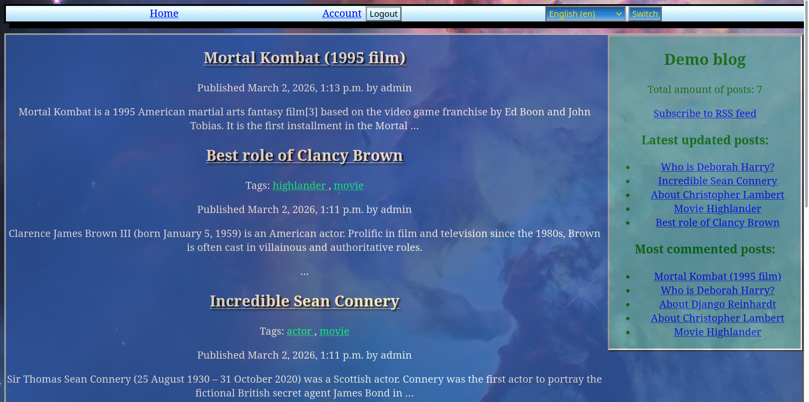

About Demo blog
========================

Screenshots
===========

Description
===========

It's a very simple blog created with Django for demostrative purposes,
development version.

__Not for production use__.

Features
========

  * All models, forms and views based on generic classes.
  * The blog has a language support for Ukranian and English languages.
  * Posts and comments have safe markdown support.
  * There is support for RSS feed and tags.

How to use
===========

   Make migrations and migrate.
   Run Django development server and enter into your browser 127.0.0.1:8000.
   It's a home page with list of available posts.

Authors
========

  - Teg Miles (movarocks2@gmail.com)

Requirements
============

+ Python 3.14, Django 6, Django-taggit 6.1.0, Markdown 3.10.2, Faker 40.5.1

